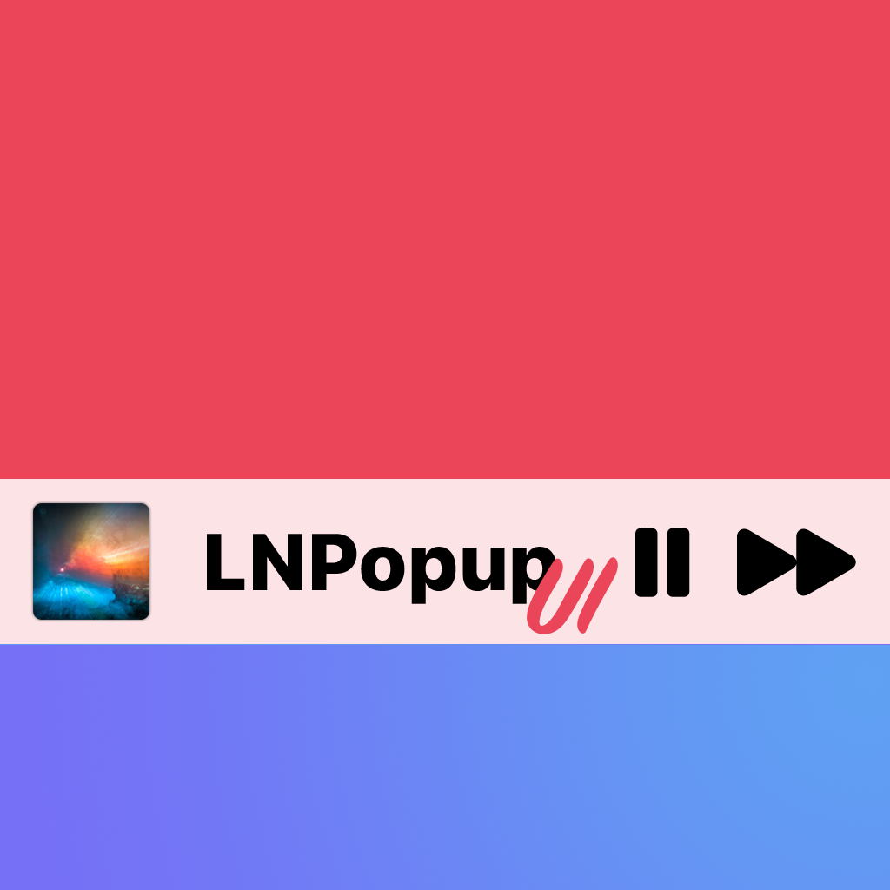
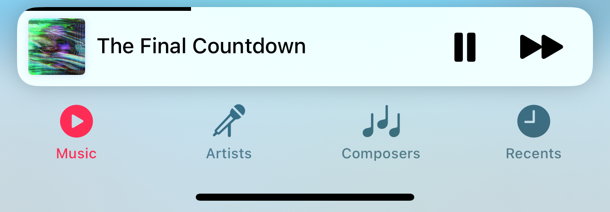
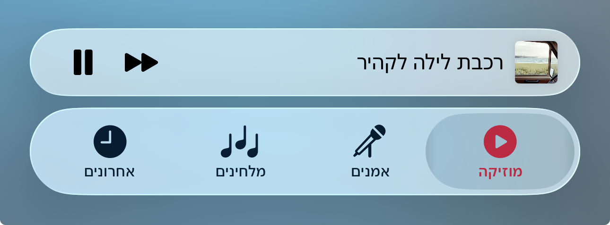

# LNPopupUI



`LNPopupUI` is a SwiftUI library for presenting views as popups, much like the Apple Music and Podcasts apps.

This is a SwiftUI wrapper of my [LNPopupController framework](https://github.com/LeoNatan/LNPopupController), adapted to work with SwiftUI.

[](https://github.com/LeoNatan/LNPopupUI/releases) [](https://github.com/LeoNatan/LNPopupUI/stargazers) [](https://raw.githubusercontent.com/LeoNatan/LNPopupUI/master/LICENSE) <span class="badge-paypal"><a href="https://www.paypal.com/cgi-bin/webscr?cmd=_s-xclick&hosted_button_id=BR68NJEJXGWL6" title="Donate to this project using PayPal"></a></span>

[](https://github.com/LeoNatan/LNPopupUI/issues) [](https://github.com/LeoNatan/LNPopupUI/graphs/contributors) 

 

 

See a video of the modern popup look & feel [here](https://vimeo.com/194064291) and a video of the classic popup look & feel [here](https://vimeo.com/137020302).

Once a popup bar is presented with a content view, the user can swipe or tap the popup at any point to present the content view. After finishing, the user dismisses the popup by either swiping or tapping the popup close button.

The library extends SwiftUI’s `View` with new functionality for presenting and opening popups with content views, as well as setting information such as the popup bar’s title, image and bar button items. When a popup is presented, the popup bar automatically adapts to the view it was presented on for best appearance.

Generally, it is recommended to present the popup bar on the outermost view, such as `TabView` or `NavigationView`. So if you have a view contained in a navigation view, which is in turn contained in a tab view, it is recommended to present the popup on the tab view.

Check the demo project for a quick recreation of Apple’s music app.

### Features

* Available for iOS 13 and above, as a SPM package for SwiftUI
* A SwiftUI library, wrapping my [LNPopupController framework](https://github.com/LeoNatan/LNPopupController); the library works internally with SwiftUI’s generated UIKit content to present the framework in a native manner

## Adding to Your Project

### Swift Package Manager

LNPopupUI supports SPM versions 5.1.0 (Xcode 11) and above. In Xcode, click `File` -> `Swift Packages` -> `Add Package Dependency`, enter `https://github.com/LeoNatan/LNPopupUI`. Select the version you’d like to use.

You can also manually add the package to your Package.swift file:

```swift
.package(url: "https://github.com/LeoNatan/LNPopupUI.git", from: "1.0.0")
```

And the dependency in your target:

```swift
.target(name: "BestExampleApp", dependencies: ["LNPopupUI"]),
```

## Using the Library

### Project Integration

Import the module in your project:

```swift
import LNPopupUI
```

### Popups

Popup consist of a popup bar and a popup content view. Information for the popup bar, such as the title, image and bar button items, is received by using the provided modifier API.

To present the popup, call the `popup(isBarPresented:isPopupOpen:content)` method:

```swift
TabView {
	//Top content view
}
.popup(isBarPresented: $isPopupPresented, isPopupOpen: $isPopupOpen) {
	PlayerView(song: currentSong)
}
```

To present and dismiss the popup bar programmatically, toggle the `isPopupPresented` bound var. To open or close the popup programmatically, toggle the `isPopupOpen` bound var.

For more information, see the documentation in [LNPopupUI.swift](https://github.com/LeoNatan/LNPopupUI/blob/master/Sources/LNPopupUI/LNPopupUI.swift).

### Popup Bar Content

Popup bar content is provided as modifiers of the popup content view.

```swift
VStack {
	//Popup content view
}
.popupTitle(song.title)
.popupImage(Image(song.imageName))
.popupProgress(playbackProgress)
.popupBarItems({
	HStack(spacing: 20) {
		Button(action: {
			isPlaying.toggle()
		}) {
			Image(systemName: "play.fill")
		}

		Button(action: {
			next()
		}) {
			Image(systemName: "forward.fill")
		}
	}
})
```


### Appearance and Behavior

#### Modern Look and Feel

`LNPopupUI` provides two distinct style of popup look and feel, one based on modern Music app look and feel, and one based on the previous, iOS 9-style look and feel. Popup bar styles are arbitrarily labeled "prominent" for modern style popup bar and "compact" for iOS 9-style. Popup interaction styles are labeled "snap" for modern style snapping popups and "drag" for iOS 9 interactive popup interaction. Popup close buttons styles are labeled "chevron" for modern style chevron close button and "round" for iOS 9-style close buttons. For each, there is a "default" style for choosing the most suitable one for the current operating system version.

The defaults are:
* Prominent bar style
* Snap interaction style
* Chevron close button style
* No progress view style

##### Bar Style

Customizing the popup bar style is achieved by calling the `.popupBarStyle()` modifier.

```swift
.popup(isBarPresented: $isPopupPresented, isPopupOpen: $isPopupOpen) {
	//Popup content view
}
.popupBarStyle(.compact)
```

##### Interaction Style

Customizing the popup interaction style is achieved by calling the `.popupInteractionStyle()` modifier.

```swift
.popup(isBarPresented: $isPopupPresented, isPopupOpen: $isPopupOpen) {
	//Popup content view
}
.popupInteractionStyle(.drag)
```

##### Progress View Style

Customizing the popup bar progress view style is achieved by calling the `.popupBarProgressViewStyle()` modifier.

```swift
.popup(isBarPresented: $isPopupPresented, isPopupOpen: $isPopupOpen) {
	//Popup content view
}
.popupBarProgressViewStyle(.top)
```

To hide the progress view, set the bar progress view style to `.none`.

##### Close Button Style

Customizing the popup close button style is achieved by calling the `.popupCloseButtonStyle()` modifier.

```swift
.popup(isBarPresented: $isPopupPresented, isPopupOpen: $isPopupOpen) {
	//Popup content view
}
.popupCloseButtonStyle(.round)
```

To hide the popup close button, set the `popupCloseButtonStyle` to `LNPopupCloseButtonStyleNone` / `.none`.

#### Full Right-to-Left Support

The library has full right-to-left support.

 

## Acknowledgements

The library uses:
* [MarqueeLabel](https://github.com/cbpowell/MarqueeLabel) Copyright (c) 2011-2020 Charles Powell

Additionally, the demo project uses:

* [LoremIpsum](https://github.com/lukaskubanek/LoremIpsum) Copyright (c) 2013-2020 Lukas Kubanek
