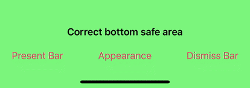

# LNPopupUI

`LNPopupUI` is a SwiftUI library for presenting views as popups, much like the Apple Music and Podcasts apps.

This is a SwiftUI wrapper of the [LNPopupController framework](https://github.com/LeoNatan/LNPopupController), adapted to work with SwiftUI.

[](https://github.com/LeoNatan/LNPopupUI/releases) [](https://github.com/LeoNatan/LNPopupUI/stargazers) [](https://raw.githubusercontent.com/LeoNatan/LNPopupUI/master/LICENSE) <span class="badge-paypal"><a href="https://paypal.me/LeoNatan25" title="Donate to this project using PayPal"></a></span>

[](https://github.com/LeoNatan/LNPopupUI/issues) [](https://github.com/LeoNatan/LNPopupUI/graphs/contributors) [](https://swift.org/package-manager/)

<p align="center"></p>

Once a popup bar is presented with a content view, the user can swipe or tap the popup bar at any point to present the content view. After finishing, the user dismisses the popup by either swiping the content view or tapping the popup close button.

The library extends SwiftUI’s `View` with new functionality for presenting and customizing popups with content views, as well as setting information such as the popup bar’s title, image and bar button items. When a popup bar is presented, the popup bar automatically adapts to the view it was presented on for best appearance.

Generally, it is recommended to present the popup bar on the outermost view, such as `TabView` or `NavigationStack`. For example, if you have a view contained in a navigation stack, which is in turn contained in a tab view, it is recommended to present the popup bar on the tab view.

Check the demo project for a quick recreation of Apple’s music app.

> [!NOTE]
> To run the example project, don't forget to update submodules by running: `git submodule update --init --recursive`

### Features

* Supports iOS 26 glass design, while maintaining a system-apropriate look and feel on previous iOS versions
* Available for iOS 14 and above, as an SPM package for SwiftUI
* For UIKit, check out the [LNPopupController framework](https://github.com/LeoNatan/LNPopupController)

## Adding to Your Project and Using the Framework

### Swift Package Manager

`LNPopupUI` supports SPM versions 6.0 (Xcode 16) and above. In Xcode, click `File`  →  `Add Package Dependencies…`, enter `https://github.com/LeoNatan/LNPopupUI`. Select the version you’d like to use.

You can also manually add the package to your Package.swift file:

```swift
.package(url: "https://github.com/LeoNatan/LNPopupUI.git", from: "2.5.0")
```

And the dependency in your target:

```swift
.target(name: "MyExampleApp", dependencies: ["LNPopupUI"]),
```

Import the module in your project:

```swift
import LNPopupUI
```

## Managing a Popup Presentation

A popup presentation consists of the following concepts:

- **Popup container view** —the `View` that hosts the popup presentation. Normally this is the outer-most tab or navigation view, but can be any view.
- **Popup content controller**—a `View` that represents the content, when the popup is open.
- **Popup bar**—a bar, docked to the bottom of the container view, either above the container’s bottom bar (tab bar or toolbar) or directly at the bottom of the screen, presenting at-a-glance information to the user and allows interaction by the user. Can be a default system popup bar style or a completely custom implementation.
- **Popup items**—the source of data that is displayed on the popup bar at any given time.
- **Custom popup bar view**—optional, when presenting a custom popup bar

<picture>
  <source media="(prefers-color-scheme: dark)" srcset="./Supplements/overview-dark.png">
  <source media="(prefers-color-scheme: light)" srcset="./Supplements/overview.png">
  
</picture>

To add a popup presentation to your scene, you use the `popup(isBarPresented:isPopupOpen:content:)` modifier. The user is then able to interact with the popup bar and popup content. 

To present and dismiss the popup bar programmatically, toggle the `isPopupBarPresented` bound boolean var. To open or close the popup programmatically, toggle the `isPopupOpen` bound boolean var.

For more information, see the documentation in [LNPopupUI.swift](https://github.com/LeoNatan/LNPopupUI/blob/master/Sources/LNPopupUI/LNPopupUI.swift).


```swift
//Container view
TabView {
    //Container content  
    AlbumViews()
}
.popup(isBarPresented: $isPopupBarPresented, isPopupOpen: $isPopupOpen) {
    //Popup content view, visible when the popup opens
    PlayerView(song: currentSong)
        .popupTitle(currentSong.title)
        .popupSubtitle(currentSong.subtitle)
        .popupImage(Image(currentSong.imageName))
        .popupBarItems {
            ToolbarItemGroup(placement: .popupBar) {
                Button {
                    isPlaying.toggle()
                } label: {
                    Image(systemName: "pause.fill")
                }
            
                Button {
                    nextSong()
                } label: {
                    Image(systemName: "forward.fill")
                }
            }
        }
}
```

<p align="center"></p>

## Appearance and Behavior

`LNPopupUI` provides functionality to present users with popup bars, open popups and let the user interact with them. By default, the framework chooses styles to match the user’s current operating system version, but can all be customized as required.

<p align="center"></p>

The defaults are:

- iOS 26:

  - Floating compact bar style
  - Snap interaction style
  - Grabber close button style

- iOS 17-18:

  - Floating bar style
  - Snap interaction style
  - Grabber close button style

- iOS 16 and below:

  - Prominent bar style
  - Snap interaction style
  - Chevron close button style

You can also present completely custom popup bars. For more information, see [Custom Popup Bar View](#custom-popup-bar-view).

By default, for navigation and tab container views, the popup bar inherits its appearance from the bottom bar. For other container views, a default appearance is used, most suitable for the current environment.

To disable inheriting the bottom bar’s appearance, call the `popupBarInheritsAppearanceFromDockingView(_:)` modifier with `false` value.

### Bar Style

Customizing the popup bar style is achieved by calling the `.popupBarStyle(_:)` modifier.

Starting with iOS 26, the framework supports primarily a floating and a compact floating popup bar.

```swift
.popup(isBarPresented: $isPopupPresented, isPopupOpen: $isPopupOpen) {
    //Popup content view
}
.popupBarStyle(.floating)
```

##### Floating Compact:

<p align="center"></p>

##### Floating:

<p align="center"></p>

#### Legacy Bar Styles

On iOS 18 and below, the framework presents popup bar styles and animations that are appropriate for the user's operating system. Non-floating prominent and compact bar styles are also available.

##### Floating:
<p align="center">

##### Prominent:
<p align="center"></p>

##### Compact:
<p align="center"></p>

> [!NOTE]
> On iOS 26 and later, non-floating bar styles will be automatically converted to the appropriate floating style.

### Interaction Style

Customizing the popup interaction style is achieved by calling the `.popupInteractionStyle(_:)` modifier.

```swift
.popup(isBarPresented: $isPopupPresented, isPopupOpen: $isPopupOpen) {
    //Popup content view
}
.popupInteractionStyle(.drag)
```

<p align="center"> </p>

### Progress View Style

By default, progress view is hidden.

Customizing the popup bar progress view style is achieved by calling the `.popupBarProgressViewStyle(_:)` modifier.

```swift
.popup(isBarPresented: $isPopupPresented, isPopupOpen: $isPopupOpen) {
    //Popup content view
}
.popupBarProgressViewStyle(.top)
```

<p align="center"><br/><br/><br/><br/></p>

### Close Button Style

Customizing the popup close button style is achieved by calling the `.popupCloseButtonStyle(_:)` modifier.

```swift
.popup(isBarPresented: $isPopupPresented, isPopupOpen: $isPopupOpen) {
    //Popup content view
}
.popupCloseButtonStyle(.prominentGlass)
```

Hide the popup close button by calling the `popupCloseButtonStyle(_:)` modifier with a value of `.none`.

To set the position of the popup close button, use the `popupCloseButtonPositioning(_:)` modifier.

<p align="center"><br/><br/> <br/><br/> </p>

### Text Marquee Scroll

Supplying long text for the title and/or subtitle will result in a scrolling text, if text marquee scroll is enabled. Otherwise, the text will be truncated. To enable or disable text marquee scrolling, use the `popupBarMarqueeScrollEnabled(_:)` modifier.

<p align="center"> </p>

### Popup Bar Minimization

The library supports popup bar minimization starting with iOS 26. Currently, it is supported with `TabView` container views.

<p align="center"></p>

To enable, set the minimization behavior of the tab view:

```swift
TabView {
	// ...
}.tabBarMinimizeBehavior(.onScrollDown)
```

To adjust the content of the accessory view based on the placement of the popup bar, add the `popupBarPlacement` environment variable to your popup content view or your custom popup bar view.


Content view:
```swift
struct PlayerView: View {
	@Environment(\.popupBarPlacement) var popupBarPlacement
	
	var body: some View {
		...
		.popupBarItems {
			ToolbarItemGroup(placement: .popupBar) {
				PlayButton()
				
				if popupBarPlacement != .inline {
					NextButton()
				}
			}
		}
	}
}
```

Custom bar view:
```swift
struct CustomBarView: View {
	@Environment(\.popupBarPlacement) var popupBarPlacement

    var body: some View {
        switch placement {
        case .inline:
            ControlsPlaybackView()
        case .regular:
            SliderPlaybackView()
    }
}
```

Popup bar minimization is enabled by default, and is supported for system and custom popup bars, with the exception of custom bars with `.popupBarCustomBarPrefersFullBarWidth(true)`. To disable popup bar minimization, use the `popupBarMinimizationEnabled(_:)` modifier with a value of `false`.

```swift
TabView {
	// ...
}
.tabBarMinimizeBehavior(.onScrollDown)
.popupBarMinimizationEnabled(false)
```

### Popup Transitions

The library supports popup image transitions:

<p align="center"></p>

Transitions are opt-in and require you apply the `.popupTransitionTarget()` modifier to your `Image` view in your popup content view, which is discovered automatically by the system and used as the target/source view for popup transitions.

> [!TIP]
> There must be a single `.popupTransitionTarget()` call inside your popup content view, or results will be undefined.

The system supports `.clipShape()` with basic shapes and a single `shadow()` modifier applied to the `Image` view.

```swift
.popup(isBarPresented: $isPopupPresented, isPopupOpen: $isPopupOpen) {
	Image("genre\(demoContent.imageNumber)")
		.resizable()
		.popupTransitionTarget()
		.aspectRatio(contentMode: .fit)
		.clipShape(RoundedRectangle(cornerRadius: 30, style: .continuous))
		.shadow(color: .indigo, radius: 20)
}
```

> [!CAUTION]
> Using a complex clip shapes and/or multiple calls to `.shadow()` can result in undefined behavior the transition may not be accurate.

Transitions are only available for drag interaction style, or transition targets are ignored.

### Popup Bar Customization

`LNPopupUI` exposes many APIs to customize the default popup bar's appearance. 

```swift
.popup(isBarPresented: $isPopupPresented, isPopupOpen: $isPopupOpen) {
    //Popup content view
}
.popupBarInheritsAppearanceFromDockingView(false)
.popupBarFloatingBackgroundShadow(color: .red, radius: 8, x: 0, y: 0)
.popupBarTitleTextAttributes(AttributeContainer()
    .font(Font.custom("Chalkduster", size: 14, relativeTo: .headline))
    .foregroundColor(.yellow)
    .paragraphStyle(customizationParagraphStyle))
.popupBarSubtitleTextAttributes(AttributeContainer()
    .font(.custom("Chalkduster", size: 12, relativeTo: .subheadline))
    .foregroundColor(.green)
    .paragraphStyle(customizationParagraphStyle))
.popupBarFloatingBackgroundShadow(color: .red, radius: 8)
.popupBarImageShadow(color: .yellow, radius: 5)
.popupBarFloatingBackgroundEffect(UIBlurEffect(style: .dark))
.popupBarBackgroundEffect(UIBlurEffect(style: .dark))
```

<p align="center"></p>

### Context Menus

You can add a context menu to your popup bar by calling the `.popupBarContextMenu(menuItems:)` modifier.

```swift
.popup(isBarPresented: $isPopupPresented, isPopupOpen: $isPopupOpen) {
    //Popup content view
}
.popupBarContextMenu {
    Button {
        print("Context Menu Item 1")
    } label: {
        Text("Context Menu Item 1")
        Image(systemName: "globe")
    }
    
    Button {
        print("Context Menu Item 2")
    } label: {
        Text("Context Menu Item 2")
        Image(systemName: "location.circle")
    }
}
```

<p align="center"></p>

### ProMotion Support

`LNPopupUI` fully supports ProMotion on iPhone and iPad.

For iPhone 13 Pro and above, you need to add the `CADisableMinimumFrameDurationOnPhone` key to your Info.plist and set it to `true`. See [Optimizing ProMotion Refresh Rates for iPhone 13 Pro and iPad Pro](https://developer.apple.com/documentation/quartzcore/optimizing_promotion_refresh_rates_for_iphone_13_pro_and_ipad_pro?language=objc) for more information. `LNPopupUI` will log a single warning message in the console if this key is missing, or is set to `false`.

### Full Right-to-Left Support

The library has full right-to-left support.

<p align="center"> </p>

### Custom Popup Bar View

You can display your own view as the popup bar, instead of the system-provided ones, by using the `.popupBarCustomView(wantsDefaultTapGesture:wantsDefaultPanGesture:wantsDefaultHighlightGesture:popupBarContent:)` modifier.

```swift
.popup(isBarPresented: $isPopupPresented, isPopupOpen: $isPopupOpen) {
    //Popup content view
}
.popupBarCustomView(wantsDefaultTapGesture: false, wantsDefaultPanGesture: false, wantsDefaultHighlightGesture: false) {
  //Custom popup bar view content
}
```

The `wantsDefaultTapGesture`, `wantsDefaultPanGesture` and `wantsDefaultHighlightGesture` arguments control whether the default system gestures of the popup bar should be enabled or disabled.

<p align="center"></p>

> [!TIP]
> Only implement a custom popup bar if you need a design that is significantly different than the provided [standard popup bar styles](#bar-style). A lot of care and effort has been put into integrating these popup bar styles with the SwiftUI view system, including look, feel, transitions and interactions. Custom bars provide a blank canvas for you to implement a bar view of your own, but if you end up recreating a bar design that is similar to a standard bar style, you are more than likely losing subtleties that have been added and perfected over the years in the standard implementations. Instead, consider using the [many customization APIs](#popup-bar-customization) to tweak the standard bar styles to fit your app’s design.

The included demo project includes an example custom popup bar scene.

### Low-Level Bar Customization

`LNPopupUI` exposes the `.popupBarCustomizer(_:)` modifier, which allows lower-level customization through the UIKit `LNPopupBar` object.

```swift
.popup(isBarPresented: $isPopupPresented, isPopupOpen: $isPopupOpen) {
    //Popup content view
}
.popupBarCustomizer { popupBar in
    popupBar.popupOpenGestureRecognizer.delegate = self.gestureRecognizerDelegateHelper
    popupBar.barHighlightGestureRecognizer.isEnabled = false
}
```

> [!TIP]
> The `.popupBarCustomizer(_:)` modifier exposes the underlying `LNPopupBar` from the `LNPopupController` framework. This framework allows modifying properties that are not exposed natively in SwiftUI, such as direct gesture recognizer control. While it is possible to customize the appearance the bar using this modifier, this API only accepts UIKit data types, such as `UIColor` and `UIFont`. Instead, use the SwiftUI-native customization APIs, which support SwiftUI-native data types, such as `Color` and `Font`, and are better integrated with rest of the SwiftUI view model.

## `LNPopupController` SwiftUI additions

In addition to the main SwiftUI functionality, the library offers extensions to `LNPopupController` for hosting SwiftUI views as popup content and custom popup bar content.

Use `LNPopupContentHostingController` to create a popup content hosting controller:

```swift
let controller = LNPopupContentHostingController {
    PlayerView(song: currentSong)
        .popupTitle(currentSong.name, subtitle: currentSong.album.name)
        .popupImage(currentSong.artwork ?? currentSong.album.artwork)
}

tabBarController?.presentPopupBar(with: controller, animated: true)
```

Or use `UIViewController.presentPopupBar(with:animated:)` directly:

```swift
tabBarController?.presentPopupBar(with: {
    PlayerView(song: currentSong)
        .popupTitle(currentSong.name, subtitle: currentSong.album.name)
        .popupImage(currentSong.artwork ?? currentSong.album.artwork)
}, animated: true)
```

Use `LNPopupCustomBarHostingController` to create a custom popup bar hosting controller:

```swift
tabBarController?.popupBar.customBarViewController = LNPopupCustomBarHostingController {
    MyCustomPlaybackControlsView()
}
```

## Acknowledgements

The library uses:
* [MarqueeLabel](https://github.com/cbpowell/MarqueeLabel) Copyright (c) 2011-2020 Charles Powell

Additionally, the demo project uses:

* [LoremIpsum](https://github.com/lukaskubanek/LoremIpsum) Copyright (c) 2013-2020 Lukas Kubanek
* [swiftui-introspect](https://github.com/siteline/swiftui-introspect) Copyright 2019 Timber Software

## Star History

[](https://star-history.com/#LeoNatan/LNPopupUI&Date)
