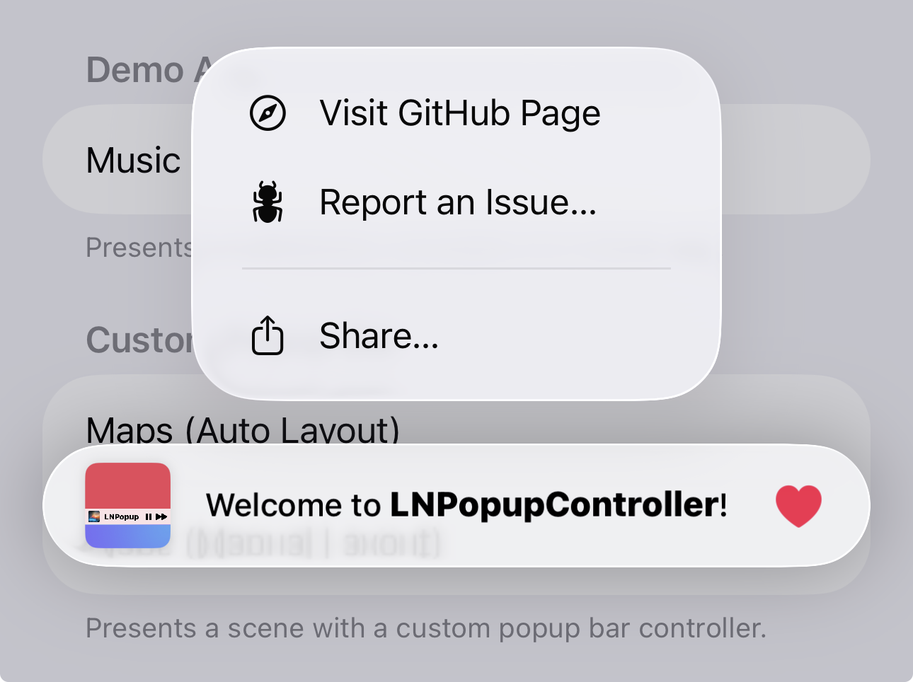

# LNPopupUI

`LNPopupUI` is a SwiftUI library for presenting views as popups, much like the Apple Music and Podcasts apps.

This is a SwiftUI wrapper of the [LNPopupController framework](https://github.com/LeoNatan/LNPopupController), adapted to work with SwiftUI.

[](https://github.com/LeoNatan/LNPopupUI/releases) [](https://github.com/LeoNatan/LNPopupUI/stargazers) [](https://raw.githubusercontent.com/LeoNatan/LNPopupUI/master/LICENSE) <span class="badge-paypal"><a href="https://paypal.me/LeoNatan25" title="Donate to this project using PayPal"></a></span>

[](https://github.com/LeoNatan/LNPopupUI/issues) [](https://github.com/LeoNatan/LNPopupUI/graphs/contributors) [](https://swift.org/package-manager/)

<p align="center"></p>

Once a popup bar is presented with a content view, the user can swipe or tap the popup bar at any point to present the content view. After finishing, the user dismisses the popup by either swiping the content view or tapping the popup close button.

The library extends SwiftUI’s `View` with new functionality for presenting and customizing popups with content views, as well as setting information such as the popup bar’s title, image and bar button items. When a popup bar is presented, the popup bar automatically adapts to the view it was presented on for best appearance.

Generally, it is recommended to present the popup bar on the outermost view, such as `TabView` or `NavigationStack`. For example, if you have a view contained in a navigation stack, which is in turn contained in a tab view, it is recommended to present the popup bar on the tab view.

Check the demo project for a quick recreation of Apple’s music app.

### Features

* Available for iOS 14 and above, as a SPM package for SwiftUI
* A SwiftUI library, wrapping the [LNPopupController framework](https://github.com/LeoNatan/LNPopupController); the library works internally with SwiftUI’s generated UIKit content to present the framework in a native manner

## Adding to Your Project

### Swift Package Manager

`LNPopupUI` supports SPM versions 5.5 (Xcode 13) and above. In Xcode, click `File` -> `Swift Packages` -> `Add Package Dependency`, enter `https://github.com/LeoNatan/LNPopupUI`. Select the version you’d like to use.

You can also manually add the package to your Package.swift file:

```swift
.package(url: "https://github.com/LeoNatan/LNPopupUI.git", from: "1.5.0")
```

And the dependency in your target:

```swift
.target(name: "BestExampleApp", dependencies: ["LNPopupUI"]),
```

## Using the Library

### Project Integration

Import the module in your project:

```swift
import LNPopupUI
```

### Popups

Popups consist of a popup bar and a popup content view. Information for the popup bar, such as the title, image and bar button items, is configured using the provided modifier APIs.

To present the popup, call the `popup(isBarPresented:isPopupOpen:content:)` method:

```swift
TabView {
	//Top content view
}
.popup(isBarPresented: $isPopupBarPresented, isPopupOpen: $isPopupOpen) {
	PlayerView(song: currentSong)
}
```

<p align="center"></p>

To present and dismiss the popup bar programmatically, toggle the `isPopupBarPresented` bound var. To open or close the popup programmatically, toggle the `isPopupOpen` bound var.

For more information, see the documentation in [LNPopupUI.swift](https://github.com/LeoNatan/LNPopupUI/blob/master/Sources/LNPopupUI/LNPopupUI.swift).

### Popup Bar Content

Popup bar content is configured using modifiers of the popup content view.

```swift
VStack {
	//Popup content view
}
.popupTitle(song.title)
.popupImage(Image(song.imageName))
.popupProgress(playbackProgress)
.popupBarItems({
	Button(action: {
		isPlaying.toggle()
	}) {
		Image(systemName: "play.fill")
	}

	Button(action: {
		next()
	}) {
		Image(systemName: "forward.fill")
	}
})
```

### Appearance and Behavior

`LNPopupUI` provides three distinct styles of popup look and feel, each based on Music app looks and feels, that Apple has introduced over the years. Popup bar styles are labeled "floating”, “prominent" and "compact", matching the appropriate Apple style. Popup interaction styles are labeled "snap" for modern style snapping popups and "drag" for iOS 9 interactive popup interaction. Popup close buttons styles are labeled "chevron" for modern style chevron close button and "round" for iOS 9-style close buttons. For each, there is a "default" style for choosing the most suitable one for the current platform and operating system version.

The defaults are:

- iOS 17:

  * Floating bar style

  * Snap interaction style

  * Chevron close button style

  * No progress view style

- iOS 16 and below:

  - Prominent bar style

  * Snap interaction style

  * Chevron close button style

  * No progress view style

You can also present completely custom popup bars. For more information, see [Custom Popup Bar View](#custom-popup-bar-view).

By default, for navigation and tab views, the appearance of the popup bar is determined according to the container’s bottom bar's appearance. For other container views, a default appearance is used, most suitable for the current environment.

<p align="center"></p>

To disable inheriting the bottom bar’s appearance, call the `popupBarInheritsAppearanceFromDockingView()` modifier with `false`.

#### Bar Style

Customizing the popup bar style is achieved by calling the `.popupBarStyle()` modifier.

```swift
.popup(isBarPresented: $isPopupPresented, isPopupOpen: $isPopupOpen) {
	//Popup content view
}
.popupBarStyle(.compact)
```

<p align="center">  </p>

#### Interaction Style

Customizing the popup interaction style is achieved by calling the `.popupInteractionStyle()` modifier.

```swift
.popup(isBarPresented: $isPopupPresented, isPopupOpen: $isPopupOpen) {
	//Popup content view
}
.popupInteractionStyle(.drag)
```

<p align="center"> </p>

#### Progress View Style

Customizing the popup bar progress view style is achieved by calling the `.popupBarProgressViewStyle()` modifier.

```swift
.popup(isBarPresented: $isPopupPresented, isPopupOpen: $isPopupOpen) {
	//Popup content view
}
.popupBarProgressViewStyle(.top)
```

To hide the progress view, set the bar progress view style to `.none`.

<p align="center"><br/><br/><br/><br/></p>

#### Close Button Style

Customizing the popup close button style is achieved by calling the `.popupCloseButtonStyle()` modifier.

```swift
.popup(isBarPresented: $isPopupPresented, isPopupOpen: $isPopupOpen) {
	//Popup content view
}
.popupCloseButtonStyle(.round)
```

To hide the popup close button, set the `popupCloseButtonStyle` to `.none`.

<p align="center"><br/><br/><br/><br/></p>

#### Text Marquee Scroll

Supplying long text for the title and/or subtitle will result in a scrolling text, if text marquee scroll is enabled. Otherwise, the text will be truncated. To enable text marquee scrolling, use the `popupBarMarqueeScrollEnabled()` modifier.

<p align="center"> </p>

#### Custom Popup Bar View

You can display your own view as the popup bar, instead of the system-provided ones, by using the `.popupBarCustomView()` modifier.

```swift
.popup(isBarPresented: $isPopupPresented, isPopupOpen: $isPopupOpen) {
	//Popup content view
}
.popupBarCustomView(wantsDefaultTapGesture: false, wantsDefaultPanGesture: false, wantsDefaultHighlightGesture: false) {
  //Custom popup bar view content
}
```

The `wantsDefaultTapGesture`, `wantsDefaultPanGesture` and `wantsDefaultHighlightGesture` arguments control whether the default system gestures of the popup bar should be enabled or disabled.

<p align="center"></p>

The included demo project includes an example custom popup bar scene.

> [!TIP]
> Only implement a custom popup bar view if you need a design that is significantly different than the provided [standard popup bar styles](#bar-style). A lot of care and effort has been put into integrating these popup bar styles with the SwiftUI system, including look, feel, transitions and interactions. Custom bars provide a blank canvas for you to implement a bar view of your own, but if you end up recreating a bar design that is similar to a standard bar style, you are more than likely losing subtleties that have been added and perfected over the years in the standard implementations. Instead, consider using the many customization APIs to tweak the standard bar styles to fit your app’s design.

#### Context Menus

You can add a context menu to your popup bar by calling the `.popupBarContextMenu()` modifier.

```swift
.popup(isBarPresented: $isPopupPresented, isPopupOpen: $isPopupOpen) {
	//Popup content view
}
.popupBarContextMenu {
	Button(action: {
		print("Context Menu Item 1")
	}) {
		Text("Context Menu Item 1")
		Image(systemName: "globe")
	}
	
	Button(action: {
		print("Context Menu Item 2")
	}) {
		Text("Context Menu Item 2")
		Image(systemName: "location.circle")
	}
}
```

<p align="center"></p>


#### ProMotion Support

`LNPopupUI` fully supports ProMotion on iPhone and iPad.

For iPhone 13 Pro and above, you need to add the `CADisableMinimumFrameDurationOnPhone` key to your Info.plist and set it to `true`. See [Optimizing ProMotion Refresh Rates for iPhone 13 Pro and iPad Pro](https://developer.apple.com/documentation/quartzcore/optimizing_promotion_refresh_rates_for_iphone_13_pro_and_ipad_pro?language=objc) for more information. `LNPopupUI` will log a single warning message in the console if this key is missing, or is set to `false`.

#### Lower-level Bar Customization

`LNPopupUI` exposes the `.popupBarCustomizer()` modifier, which allows lower-level customization through the UIKit `LNPopupBar` object.

```swift
.popup(isBarPresented: $isPopupPresented, isPopupOpen: $isPopupOpen) {
	//Popup content view
}
.popupBarInheritsAppearanceFromDockingView(false)
.popupBarCustomizer { popupBar in
	let paragraphStyle = NSMutableParagraphStyle()
	paragraphStyle.alignment = .right
	paragraphStyle.lineBreakMode = .byTruncatingTail

	popupBar.standardAppearance.backgroundEffect = UIBlurEffect(style: .dark)
	popupBar.standardAppearance.titleTextAttributes = [ .paragraphStyle: paragraphStyle, .font: UIFont(name: "Chalkduster", size: 14)!, .foregroundColor: UIColor.yellow ]
	popupBar.standardAppearance.subtitleTextAttributes = [ .paragraphStyle: paragraphStyle, .font: UIFont(name: "Chalkduster", size: 12)!, .foregroundColor: UIColor.green ]

	popupBar.tintColor = .yellow
}
```

<p align="center">  </p>

#### Full Right-to-Left Support

The library has full right-to-left support.

<p align="center"> </p>

## Acknowledgements

The library uses:
* [MarqueeLabel](https://github.com/cbpowell/MarqueeLabel) Copyright (c) 2011-2020 Charles Powell

Additionally, the demo project uses:

* [LoremIpsum](https://github.com/lukaskubanek/LoremIpsum) Copyright (c) 2013-2020 Lukas Kubanek
